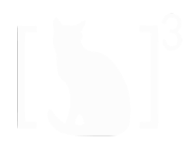
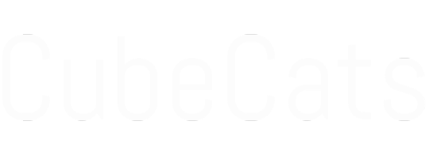

# LEOPARDSat-PMACS Simulation
<div style="width: 50%; margin-left: auto; margin-right: auto;">
    
    
</div>
This repository aims to document and open-source the necessary scripts to simulate Passive Magnetic Attitude Control.  By taking in starting paramaters from the magnet and the hysteresis material, this script will calculate the detumbling time of a CubeSat and will iteratively solve to find the least massive solution given the time constraint.

## Environment Setup
Prerequesites:
- Git
- Python 3.12.0+
- Ansys AGI Orbital STK

To begin the repository install, first navigate to your directory of choice, then open a console window (`win + x` on windows) and copy/paste the follwing to download the repository:
```
git clone https://github.com/uccubecats/LEOPARDSat-PMACS.git
```
After that, copy/paste the following to dowload the necessary python libraries:
```
py -m venv .venv; .venv/scripts/activate; pip install -r requirements.txt
```

## Starting the Simulation
Running the simulation requires two steps:
1. Enter your parameters into `src/parameters.yaml`.
1. Begin the simulation by runing `src/main.py`.

## Credits
- Justin Panchula
- Madison Coyne
- Brynn Giffin
- Bridget Sciartelli